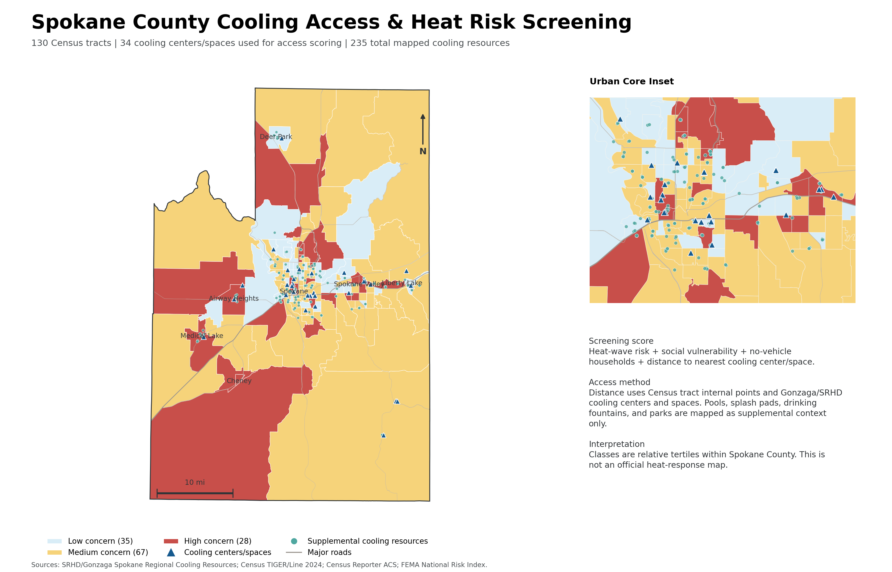
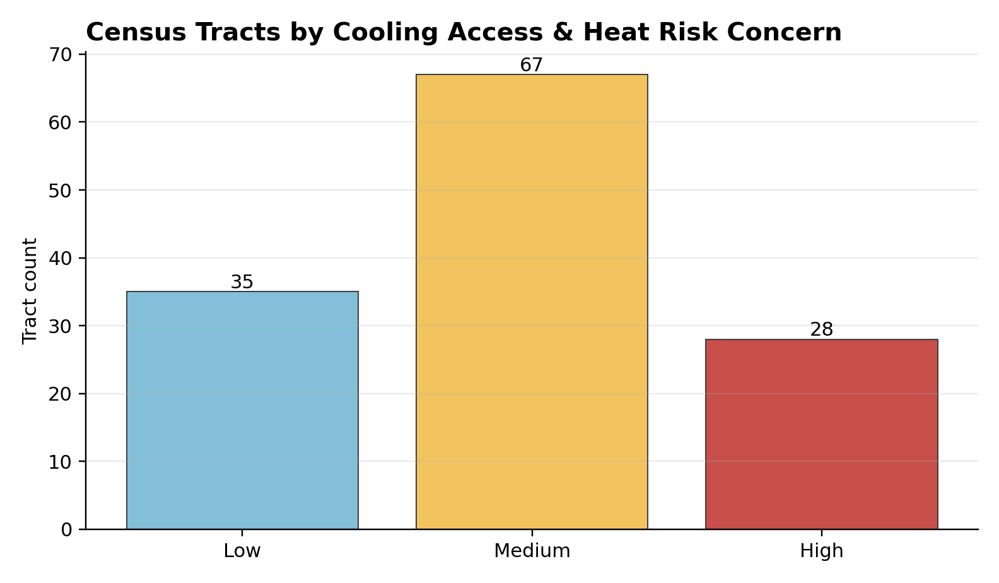
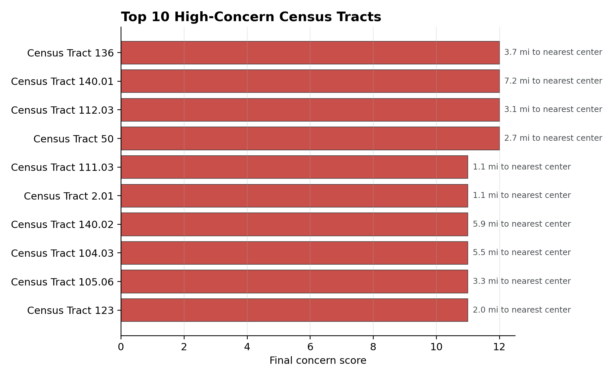

# Community Cooling Access & Heat Risk Analysis

## Project Overview

This ArcGIS portfolio project analyzes neighborhood heat-risk exposure and access to cooling resources using public facility, Census, FEMA heat-risk, and social vulnerability data.

The project is intended to demonstrate a practical GIS screening workflow for community planning: identifying places where heat exposure, social vulnerability, and limited access to cooling resources may overlap.

## Research Question

Which neighborhoods have higher heat-risk concern and limited access to cooling resources such as libraries, community centers, parks, transit-accessible public facilities, or official cooling centers?

## Study Area

Study area: Spokane County, Washington.

Spokane County is large enough to show urban/suburban/rural variation, has meaningful summer heat exposure, and is manageable for a portfolio-scale ArcGIS Pro project. The workflow can be adapted to another city or county if a better local cooling-center dataset is selected.

## Data Sources

Public data sources used in the first analysis build:

- U.S. Census Bureau TIGER/Line 2024 county and tract boundaries.
- Census Reporter ACS tables for population, poverty, age sensitivity, and no-vehicle households.
- FEMA National Risk Index Census Tracts FeatureServer for heat-wave risk and social vulnerability scores.
- Spokane Regional Health District / Gonzaga Spokane Regional Cooling Resources FeatureServer layers for cooling centers, cooling spaces, parks, pools, splash pads, and drinking fountains.
- U.S. Census Bureau TIGER/Line 2024 roads for major-road context.

See `data_source_references.txt` for working source links.

## Methods

The project organizes raw source data, processed feature classes, map exports, and documentation in a reproducible ArcGIS Pro project structure.

Current workflow:

1. Define Spokane County as the study boundary.
2. Import 2024 TIGER/Line Census tracts and county boundary.
3. Pull ACS tract indicators from Census Reporter.
4. Pull FEMA National Risk Index heat-wave and social vulnerability fields.
5. Query the Gonzaga/SRHD regional cooling-resource web map layers and clip resources to Spokane County.
6. Use cooling centers and cooling spaces as the primary access layer.
7. Map parks, pools, splash pads, and drinking fountains as supplemental cooling-resource context.
8. Calculate each tract's distance from its Census internal point to the nearest cooling center or cooling space.
9. Score each tract from 4 to 12 using heat-wave risk, social vulnerability, no-vehicle households, and nearest cooling-resource distance.
10. Export a polished screening map, urban-core inset, charts, tract summary table, and high-concern tract table.

## Outputs

- ArcGIS Pro project: `Community_Cooling_Access_Heat_Risk.aprx`
- File geodatabase: `data_processed/Community_Cooling_Access_Heat_Risk.gdb`
- Final map export: `outputs/maps/spokane_cooling_access_heat_risk_map.png`
- Final map PDF: `outputs/maps/spokane_cooling_access_heat_risk_map.pdf`
- Concern-class chart: `outputs/figures/concern_class_counts.png`
- Top high-concern tract chart: `outputs/figures/top_high_concern_tracts.png`
- Tract summary: `data_processed/cooling_heat_risk_tract_summary.csv`
- Ranked high-concern table: `outputs/high_concern_tracts.csv`
- Reproducible build script: `scripts/build_analysis.py`

## Visual Outputs

## Results Summary

The improved analysis build includes 130 Spokane County Census tracts, 34 cooling centers/spaces used for access scoring, and 235 total mapped cooling resources. Supplemental resources include 92 parks, 69 drinking fountains, 26 splash pads, and 14 public pools.

Concern class counts:

- Low: 35 tracts
- Medium: 67 tracts
- High: 28 tracts

Top high-concern tracts by final score:

| Tract | Class | Score | Nearest cooling resource (mi) | No-vehicle households (%) | FEMA heat-wave risk score |
|---|---:|---:|---:|---:|---:|
| Census Tract 140.01 | High | 12 | 7.23 | 8.19 | 81.08 |
| Census Tract 136 | High | 12 | 3.71 | 8.50 | 73.68 |
| Census Tract 112.03 | High | 12 | 3.08 | 14.49 | 74.24 |
| Census Tract 50 | High | 12 | 2.66 | 9.49 | 70.11 |
| Census Tract 140.02 | High | 11 | 5.90 | 7.42 | 71.75 |

## Limitations

This is an independent portfolio GIS screening project. It is not official emergency-management, public-health, or heat-response guidance. Cooling-resource availability can change by day, season, staffing, operating hours, and emergency activation status. The mapped resources come from the public Gonzaga/SRHD regional cooling-resource map, but any operational use would still require validation with local agencies.

## Skills Demonstrated

- ArcGIS Pro project organization
- Public GIS data acquisition
- Coordinate systems and projections
- Demographic and vulnerability overlay
- Proximity and access analysis
- Attribute calculations and index scoring
- Cartographic layout design
- Reproducible GIS documentation
